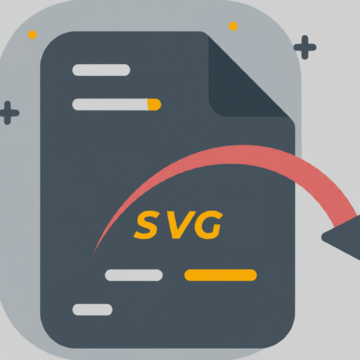

# SVG-Extract

Extracts inline SVGs into separate files, and imports them back. It supports `TypeScript`, `JavaScript`, `Astro`, etc.



## Demo

Given the following Astro file:

```jsx
---
---

<div id="some_button">
  <svg fill="currentColor" viewBox="0 0 20 20" xmlns="http://www.w3.org/2000/svg"
    ><path
      fill-rule="evenodd"
      d="M12.707 5.293a1 1 0 010 1.414L9.414 10l3.293 3.293a1 1 0 01-1.414 1.414l-4-4a1 1 0 010-1.414l4-4a1 1 0 011.414 0z"
      clip-rule="evenodd"></path></svg
  >
</div>
```

After selecting the SVG and running the `Extract SVG` command, the file will be updated to:

```jsx
---
import chevron_left from "./chevron_left.svg?raw"

---

<div id="some_button">
  <Fragment set:html={chevron_left} />
</div>
```

And file `chevron_left.svg` will be created in the same directory as the original file.


